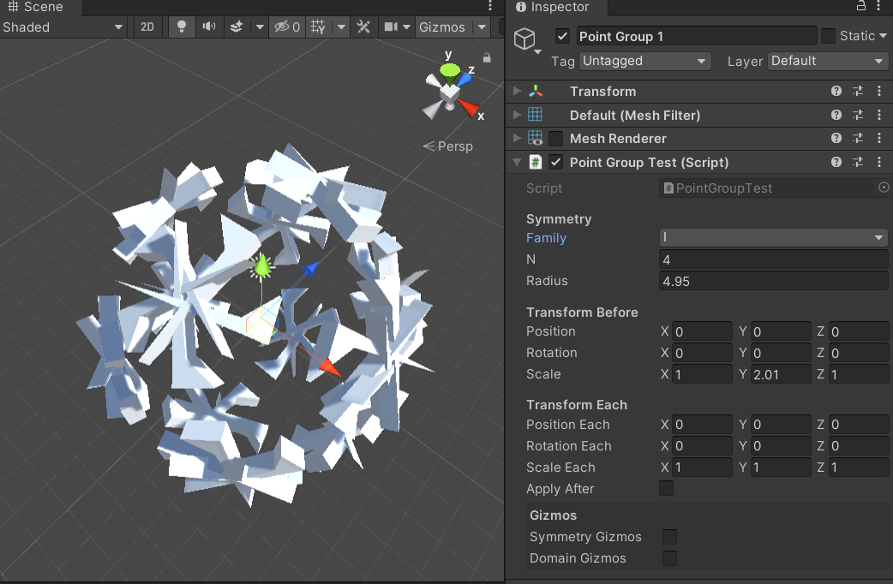

# Unity Symmetry

Generate Unity `Matrix4x4` transforms for repeated meshes, GameObjects, drawing tools and procedural patterns. The package includes crystallographic symmetry, arbitrary-order line groups and Penrose rhomb tilings, with no external runtime database dependency.

## Supported generators

| Generator | Capability | Example scene |
| --- | --- | --- |
| `PointSymmetry` | Cyclic, dihedral, tetrahedral, octahedral and icosahedral families | Point Group Test |
| `WallpaperSymmetry` | All 17 wallpaper groups in local XY | Wallpaper Test |
| `HelicalSymmetry` | Rotation and advance along local Y | Helical Test |
| `SpaceGroupSymmetry` | All 230 space groups, repeated in three dimensions | Space Group Test |
| `RodGroupSymmetry` | All 75 crystallographic rod groups, periodic along local Z | Rod Group Test |
| `LayerGroupSymmetry` | All 80 layer groups, periodic in local XY with 3D operations | Layer Group Test |
| `FriezeSymmetry` | All seven frieze groups, periodic along local X | Frieze Test |
| `LineGroupSymmetry` | All thirteen general line-group families, with arbitrary axial order along local Z | Line Group Test |
| `PenroseTiling` | Finite quasiperiodic patches of thin and thick rhombs, with motif placements | Penrose Test |

Each generator exposes `matrices`. Penrose also exposes indexed tile geometry and a Thin, Thick or Both placement selector. The generators produce transforms; the caller decides how to render or apply them. Each example scene offers a domain, cell, step or frame preview separately from sample shapes or motifs.

## Install

1. In Unity, open **Window > Package Manager**.
2. Choose **Add package from git URL** and enter:

   ```text
   https://github.com/IxxyXR/unity-symmetry.git#upm
   ```

3. For the interactive examples, clone or download this repository and open the project instead. The example project uses Unity **2022.3.62f2**; scenes are in `Assets/Scenes`. They are not included in the standalone UPM package.

## Quick start

```csharp
using UnityEngine;

var symmetry = new LineGroupSymmetry(
    LineGroupSymmetry.Family.ScrewHalfTurns,
    n: 5, repeats: 8, advance: 1.1f, angleDegrees: 27f);

// Apply each local symmetry operation to the same source pose.
Matrix4x4 sourcePose = Matrix4x4.TRS(
    new Vector3(1f, 0f, 0f), Quaternion.identity, Vector3.one);
foreach (Matrix4x4 operation in symmetry.matrices)
{
    Matrix4x4 copyPose = operation * sourcePose;
    // Pass copyPose to your rendering or placement code.
}
```

For a pattern placed under a world transform, use `patternLocalToWorld * operation * sourceLocalPose`. Reflection matrices require a representation that preserves negative scale; position and rotation alone cannot express every operation.

See the [package guide](Packages/UnitySymmetry/README.md) for constructor examples, coordinate conventions, catalogs, tile selection and data regeneration. See the [changelog](Packages/UnitySymmetry/CHANGELOG.md) and [third-party notices](Packages/UnitySymmetry/Third%20Party%20Notices.md) for changes and data attribution.


